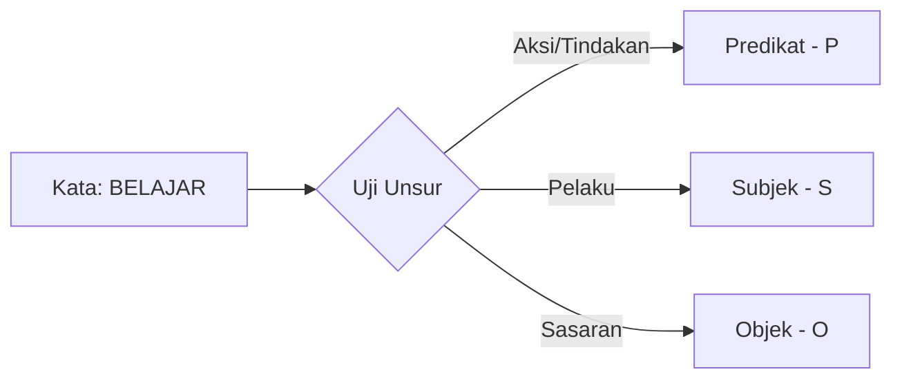

# Modul Pembelajaran Tata Bahasa SPOK (BISARA)

Selamat datang di Modul Pembelajaran Tata Bahasa SPOK untuk bahasa isyarat **BISINDO** (Bahasa Isyarat Indonesia). Modul ini disusun untuk mendukung pembelajaran interaktif dari **Level 1 hingga Level 6** di platform BISARA, membantu siswa inklusi memahami cara menyusun kalimat bahasa isyarat yang terstruktur dan bermakna.

---

## 🎯 Peta Pembelajaran & Kosakata Target

Berikut adalah peta kosakata target yang dipelajari pada setiap level asesmen SPOK:

| Level | Fokus Keterampilan | Kosakata Target Utama |
| :--- | :--- | :--- |
| **Level 1** | Mengenal Posisi SPOK | **Saya**, **Makan**, **Buku**, **Sekolah**, **Guru** |
| **Level 2** | Mencocokkan Unsur | **Kiko**, **Belajar**, **Minum**, **Tolong** |
| **Level 3** | Menyusun Kalimat | **Ayah**, **Rumah**, **Kopi**, **Membaca** |
| **Level 4** | Melengkapi Kalimat | **Ibu**, **Roti**, **Kamus**, **Pergi** |
| **Level 5** | Identifikasi Unsur | **Kakak**, **Menulis**, **Surat**, **Kantor** |
| **Level 6** | Kalimat Kontekstual Mandiri | **Adik**, **Bermain**, **Bola**, **Lapangan** |

---

## 📚 Detail Materi per Kosakata (Level 1 - Level 6)

Setiap kosakata di bawah ini dilengkapi dengan panduan gerakan isyarat BISINDO, peran gramatikal SPOK default, dan **3 konteks kalimat yang berbeda** beserta analisis tata bahasanya.

---

### 🌟 LEVEL 1: MENGENAL POSISI SPOK

#### **1. SAYA (Kata Benda / Kata Ganti Orang)**
*   **Gerakan Isyarat BISINDO**: Ketuk bagian tengah dada Anda perlahan sekali menggunakan ibu jari atau telapak tangan kanan terbuka.
*   **Peran SPOK Default**: **Subjek (S)**.

> [!NOTE]
> **Konteks 1: Formal / Sekolah**
> *   *Kalimat*: **Saya** belajar matematika.
> *   *Bedah SPOK*: **Saya** (S) - **belajar** (P) - **matematika** (O).
> *   *Urutan BISINDO*: `SAYA` ➔ `BELAJAR` ➔ `MATEMATIKA`.
>
> **Konteks 2: Santai / Rumah**
> *   *Kalimat*: **Saya** makan nasi goreng.
> *   *Bedah SPOK*: **Saya** (S) - **makan** (P) - **nasi goreng** (O).
> *   *Urutan BISINDO*: `SAYA` ➔ `MAKAN` ➔ `NASI` ➔ `GORENG`.
>
> **Konteks 3: Sosial / Permohonan**
> *   *Kalimat*: Tolong bantu **saya**.
> *   *Bedah SPOK*: **Tolong** (Lainnya/L) - **bantu** (P) - **saya** (O - bertindak sebagai objek karena berada setelah kata kerja).
> *   *Urutan BISINDO*: `TOLONG` ➔ `BANTU` ➔ `SAYA`.

---

#### **2. MAKAN (Kata Kerja)**
*   **Gerakan Isyarat BISINDO**: Kuncupkan ujung-ujung jari tangan kanan menyatu, lalu arahkan mendekati mulut secara berulang (seperti menyuap makanan).
*   **Peran SPOK Default**: **Predikat (P)**.

> [!NOTE]
> **Konteks 1: Formal / Sekolah**
> *   *Kalimat*: Siswa **makan** roti di kantin.
> *   *Bedah SPOK*: **Siswa** (S) - **makan** (P) - **roti** (O) - **di kantin** (K).
> *   *Urutan BISINDO*: `SISWA` ➔ `MAKAN` ➔ `ROTI` ➔ `DI` ➔ `KANTIN`.
>
> **Konteks 2: Santai / Rumah**
> *   *Kalimat*: Kucing **makan** ikan.
> *   *Bedah SPOK*: **Kucing** (S) - **makan** (P) - **ikan** (O).
> *   *Urutan BISINDO*: `KUCING` ➔ `MAKAN` ➔ `IKAN`.
>
> **Konteks 3: Sosial / Permohonan**
> *   *Kalimat*: Saya ingin **makan** buah.
> *   *Bedah SPOK*: **Saya** (S) - **ingin makan** (P) - **buah** (O).
> *   *Urutan BISINDO*: `SAYA` ➔ `MAKAN` ➔ `BUAH`.

---

#### **3. BUKU (Kata Benda)**
*   **Gerakan Isyarat BISINDO**: Katupkan kedua telapak tangan merapat di depan dada, lalu buka perlahan seperti membuka lembaran buku.
*   **Peran SPOK Default**: **Objek (O)** atau **Subjek (S)**.

> [!NOTE]
> **Konteks 1: Formal / Sekolah**
> *   *Kalimat*: Guru membagikan **buku** baru.
> *   *Bedah SPOK*: **Guru** (S) - **membagikan** (P) - **buku** (O) - **baru** (L).
> *   *Urutan BISINDO*: `GURU` ➔ `BAGI` ➔ `BUKU` ➔ `BARU`.
>
> **Konteks 2: Santai / Rumah**
> *   *Kalimat*: **Buku** itu tebal sekali.
> *   *Bedah SPOK*: **Buku** (S) - **tebal** (P/Sifat) - **sekali** (L).
> *   *Urutan BISINDO*: `BUKU` ➔ `TEBAL` ➔ `SEKALI`.
>
> **Konteks 3: Sosial / Permohonan**
> *   *Kalimat*: Tolong ambilkan **buku** gambar.
> *   *Bedah SPOK*: **Tolong** (L) - **ambilkan** (P) - **buku gambar** (O).
> *   *Urutan BISINDO*: `TOLONG` ➔ `AMBIL` ➔ `BUKU` ➔ `GAMBAR`.

---

#### **4. SEKOLAH (Kata Benda Tempat)**
*   **Gerakan Isyarat BISINDO**: Satukan ujung jari kedua tangan membentuk segitiga atap rumah, kemudian ketukkan ujung jari kanan di telapak kiri mendatar (melambangkan belajar di dalam gedung).
*   **Peran SPOK Default**: **Keterangan Tempat (K)** atau **Subjek (S)**.

> [!NOTE]
> **Konteks 1: Formal / Sekolah**
> *   *Kalimat*: Kami pergi ke **sekolah** pagi hari.
> *   *Bedah SPOK*: **Kami** (S) - **pergi** (P) - **ke sekolah** (K-Tempat) - **pagi hari** (K-Waktu).
> *   *Urutan BISINDO*: `KAMI` ➔ `PERGI` ➔ `KE` ➔ `SEKOLAH` ➔ `PAGI`.
>
> **Konteks 2: Santai / Rumah**
> *   *Kalimat*: Gedung **sekolah** itu dicat biru.
> *   *Bedah SPOK*: **Gedung sekolah** (S) - **dicat** (P) - **biru** (O/Pelengkap).
> *   *Urutan BISINDO*: `GEDUNG` ➔ `SEKOLAH` ➔ `CAT` ➔ `BIRU`.
>
> **Konteks 3: Sosial / Permohonan**
> *   *Kalimat*: Mari rapikan kelas di **sekolah**.
> *   *Bedah SPOK*: **Mari** (L) - **rapikan** (P) - **kelas** (O) - **di sekolah** (K).
> *   *Urutan BISINDO*: `MARI` ➔ `RAPI` ➔ `KELAS` ➔ `DI` ➔ `SEKOLAH`.

---

#### **5. GURU (Kata Benda Orang)**
*   **Gerakan Isyarat BISINDO**: Sentuhkan ujung jari telunjuk dan jempol kanan merapat di dekat kening kanan, kemudian gerakkan lurus ke bawah secara wibawa.
*   **Peran SPOK Default**: **Subjek (S)** atau **Objek (O)**.

> [!NOTE]
> **Konteks 1: Formal / Sekolah**
> *   *Kalimat*: **Guru** menjelaskan pelajaran sejarah.
> *   *Bedah SPOK*: **Guru** (S) - **menjelasan** (P) - **pelajaran sejarah** (O).
> *   *Urutan BISINDO*: `GURU` ➔ `JELAS` ➔ `PELAJARAN` ➔ `SEJARAH`.
>
> **Konteks 2: Santai / Rumah**
> *   *Kalimat*: Ibu saya seorang **guru** SLB.
> *   *Bedah SPOK*: **Ibu saya** (S) - **adalah** (P) - **guru SLB** (O/Pelengkap).
> *   *Urutan BISINDO*: `IBU` ➔ `SAYA` ➔ `GURU` ➔ `S-L-B`.
>
> **Konteks 3: Sosial / Permohonan**
> *   *Kalimat*: Siswa memberi hormat kepada **guru**.
> *   *Bedah SPOK*: **Siswa** (S) - **memberi hormat** (P) - **kepada guru** (O - bertindak sebagai objek penerima tindakan).
> *   *Urutan BISINDO*: `SISWA` ➔ `HORMAT` ➔ `GURU`.

---

### 🌟 LEVEL 2: MENCOCOKKAN UNSUR

#### **6. KIKO (Kata Benda Nama)**
*   **Gerakan Isyarat BISINDO**: Tekuk jari telunjuk dan jari tengah tangan kanan di atas kepala seperti telinga kelinci yang bergoyang melambangkan tutor pintar kelinci Bisara.
*   **Peran SPOK Default**: **Subjek (S)**.

> [!NOTE]
> **Konteks 1: Formal / Sekolah**
> *   *Kalimat*: **Kiko** membantu teman tuli.
> *   *Bedah SPOK*: **Kiko** (S) - **membantu** (P) - **teman tuli** (O).
> *   *Urutan BISINDO*: `KIKO` ➔ `BANTU` ➔ `TEMAN` ➔ `TULI`.
>
> **Konteks 2: Santai / Rumah**
> *   *Kalimat*: **Kiko** menggambar wortel lucu.
> *   *Bedah SPOK*: **Kiko** (S) - **menggambar** (P) - **wortel lucu** (O).
> *   *Urutan BISINDO*: `KIKO` ➔ `GAMBAR` ➔ `WORTEL` ➔ `LUCU`.
>
> **Konteks 3: Sosial / Permohonan**
> *   *Kalimat*: Berikan boneka itu kepada **Kiko**.
> *   *Bedah SPOK*: **Berikan** (P) - **boneka** (O) - **kepada Kiko** (K-Penerima).
> *   *Urutan BISINDO*: `KASIH` ➔ `BONEKA` ➔ `KIKO`.

---

#### **7. BELAJAR (Kata Kerja)**
*   **Gerakan Isyarat BISINDO**: Buka telapak tangan kiri mendatar di depan dada, lalu ketukkan ujung-ujung jari tangan kanan menyatu berulang kali di atas telapak tangan kiri.
*   **Peran SPOK Default**: **Predikat (P)**.

> [!NOTE]
> **Konteks 1: Formal / Sekolah**
> *   *Kalimat*: Kami **belajar** bahasa isyarat di kelas.
> *   *Bedah SPOK*: **Kami** (S) - **belajar** (P) - **bahasa isyarat** (O) - **di kelas** (K-Tempat).
> *   *Urutan BISINDO*: `KAMI` ➔ `BELAJAR` ➔ `BAHASA` ➔ `ISYARAT` ➔ `DI` ➔ `KELAS`.
>
> **Konteks 2: Santai / Rumah**
> *   *Kalimat*: Saya **belajar** memasak kue di dapur.
> *   *Bedah SPOK*: **Saya** (S) - **belajar** (P) - **memasak kue** (O) - **di dapur** (K-Tempat).
> *   *Urutan BISINDO*: `SAYA` ➔ `BELAJAR` ➔ `MASAK` ➔ `KUE` ➔ `DI` ➔ `DAPUR`.
>
> **Konteks 3: Sosial / Permohonan**
> *   *Kalimat*: Tolong dampingi adik **belajar**.
> *   *Bedah SPOK*: **Tolong** (L) - **dampingi** (P1) - **adik** (O) - **belajar** (P2).
> *   *Urutan BISINDO*: `TOLONG` ➔ `TEMANI` ➔ `ADIK` ➔ `BELAJAR`.

---

#### **8. MINUM (Kata Kerja)**
*   **Gerakan Isyarat BISINDO**: Bentuk genggaman tangan kanan seperti memegang gelas kecil, lalu gerakkan ibu jari mengarah ke bibir seolah menenggak cairan.
*   **Peran SPOK Default**: **Predikat (P)**.

> [!NOTE]
> **Konteks 1: Formal / Sekolah**
> *   *Kalimat*: Guru **minum** teh hangat di kantor.
> *   *Bedah SPOK*: **Guru** (S) - **minum** (P) - **teh hangat** (O) - **di kantor** (K-Tempat).
> *   *Urutan BISINDO*: `GURU` ➔ `MINUM` ➔ `TEH` ➔ `HANGAT` ➔ `DI` ➔ `KANTOR`.
>
> **Konteks 2: Santai / Rumah**
> *   *Kalimat*: Ayah **minum** susu putih.
> *   *Bedah SPOK*: **Ayah** (S) - **minum** (P) - **susu putih** (O).
> *   *Urutan BISINDO*: `AYAH` ➔ `MINUM` ➔ `SUSU` ➔ `PUTIH`.
>
> **Konteks 3: Sosial / Permohonan**
> *   *Kalimat*: Bolehkah saya meminta **minum**?
> *   *Bedah SPOK*: **Bolehkah saya** (S) - **meminta** (P) - **minum** (O).
> *   *Urutan BISINDO*: `MINTA` ➔ `MINUM`.

---

#### **9. TOLONG (Kata Santun)**
*   **Gerakan Isyarat BISINDO**: Katupkan kedua telapak tangan rapat di depan dada (seperti posisi berdoa atau memberi salam hangat) seakan memohon bantuan secara santun.
*   **Peran SPOK Default**: **Lainnya (L)** (Umumnya bertindak sebagai partikel penegas kesantunan di awal kalimat).

> [!NOTE]
> **Konteks 1: Formal / Sekolah**
> *   *Kalimat*: **Tolong** hapus papan tulis itu.
> *   *Bedah SPOK*: **Tolong** (L) - **hapus** (P) - **papan tulis** (O) - **itu** (L).
> *   *Urutan BISINDO*: `TOLONG` ➔ `BERSIH` ➔ `PAPAN` ➔ `TULIS` ➔ `ITU`.
>
> **Konteks 2: Santai / Rumah**
> *   *Kalimat*: Ibu, **tolong** ambilkan piring bersih.
> *   *Bedah SPOK*: **Ibu** (S) - **tolong** (L) - **ambilkan** (P) - **piring bersih** (O).
> *   *Urutan BISINDO*: `IBU` ➔ `TOLONG` ➔ `AMBIL` ➔ `PIRING` ➔ `BERSIH`.
>
> **Konteks 3: Sosial / Permohonan**
> *   *Kalimat*: **Tolong** tunjukkan jalan ke stasiun.
> *   *Bedah SPOK*: **Tolong** (L) - **tunjukkan** (P) - **jalan** (O) - **ke stasiun** (K-Arah).
> *   *Urutan BISINDO*: `TOLONG` ➔ `TUNJUK` ➔ `JALAN` ➔ `KE` ➔ `STASIUN`.

---

### 🌟 LEVEL 3: MENYUSUN KALIMAT

#### **10. AYAH (Kata Benda Orang)**
*   **Gerakan Isyarat BISINDO**: Tempelkan telunjuk tangan kanan mendatar di atas bibir kanan (seperti melambangkan kumis).
*   **Peran SPOK Default**: **Subjek (S)** atau **Objek (O)**.

> [!NOTE]
> **Konteks 1: Formal / Sekolah**
> *   *Kalimat*: **Ayah** menghadiri rapat wali murid.
> *   *Bedah SPOK*: **Ayah** (S) - **menghadiri** (P) - **rapat wali murid** (O).
> *   *Urutan BISINDO*: `AYAH` ➔ `DATANG` ➔ `RAPAT` ➔ `SEKOLAH`.
>
> **Konteks 2: Santai / Rumah**
> *   *Kalimat*: **Ayah** memotong rumput halaman.
> *   *Bedah SPOK*: **Ayah** (S) - **memotong** (P) - **rumput** (O) - **halaman** (K-Tempat).
> *   *Urutan BISINDO*: `AYAH` ➔ `POTONG` ➔ `RUMPUT` ➔ `HALAMAN`.
>
> **Konteks 3: Sosial / Permohonan**
> *   *Kalimat*: Adik memeluk **Ayah** erat-erat.
> *   *Bedah SPOK*: **Adik** (S) - **memeluk** (P) - **Ayah** (O) - **erat-erat** (K-Cara).
> *   *Urutan BISINDO*: `ADIK` ➔ `PELUK` ➔ `AYAH` ➔ `ERAT`.

---

#### **11. RUMAH (Kata Benda Tempat)**
*   **Gerakan Isyarat BISINDO**: Satukan ujung jari kedua tangan membentuk segitiga atap rumah tegak di depan dada.
*   **Peran SPOK Default**: **Keterangan (K)**, **Objek (O)**, atau **Subjek (S)**.

> [!NOTE]
> **Konteks 1: Formal / Sekolah**
> *   *Kalimat*: Guru berkunjung ke **rumah** Budi.
> *   *Bedah SPOK*: **Guru** (S) - **berkunjung** (P) - **ke rumah Budi** (K-Tempat).
> *   *Urutan BISINDO*: `GURU` ➔ `MAIN` ➔ `KE` ➔ `RUMAH` ➔ `BUDI`.
>
> **Konteks 2: Santai / Rumah**
> *   *Kalimat*: Kami mengecat dinding **rumah**.
> *   *Bedah SPOK*: **Kami** (S) - **mengecat** (P) - **dinding rumah** (O).
> *   *Urutan BISINDO*: `KAMI` ➔ `CAT` ➔ `TEMBOK` ➔ `RUMAH`.
>
> **Konteks 3: Sosial / Permohonan**
> *   *Kalimat*: Tolong antarkan barang ini ke **rumah**.
> *   *Bedah SPOK*: **Tolong** (L) - **antarkan** (P) - **barang ini** (O) - **ke rumah** (K-Tempat).
> *   *Urutan BISINDO*: `TOLONG` ➔ `ANTAR` ➔ `BARANG` ➔ `INI` ➔ `KE` ➔ `RUMAH`.

---

#### **12. KOPI (Kata Benda)**
*   **Gerakan Isyarat BISINDO**: Tangan kanan membentuk lingkaran jempol-telunjuk seolah memegang cangkir, lalu gerakkan memutar di atas telapak tangan kiri seolah sedang mengaduk minuman hangat.
*   **Peran SPOK Default**: **Objek (O)**.

> [!NOTE]
> **Konteks 1: Formal / Sekolah**
> *   *Kalimat*: Kepala sekolah meminum **kopi** hitam.
> *   *Bedah SPOK*: **Kepala sekolah** (S) - **meminum** (P) - **kopi hitam** (O).
> *   *Urutan BISINDO*: `KEPALA` ➔ `SEKOLAH` ➔ `MINUM` ➔ `KOPI` ➔ `HITAM`.
>
> **Konteks 2: Santai / Rumah**
> *   *Kalimat*: Kakak membuat segelas **kopi** manis.
> *   *Bedah SPOK*: **Kakak** (S) - **membuat** (P) - **segelas kopi manis** (O).
> *   *Urutan BISINDO*: `KAKAK` ➔ `BUAT` ➔ `GELAS` ➔ `KOPI` ➔ `MANIS`.
>
> **Konteks 3: Sosial / Permohonan**
> *   *Kalimat*: Tolong belikan bubuk **kopi** instan.
> *   *Bedah SPOK*: **Tolong** (L) - **belikan** (P) - **bubuk kopi instan** (O).
> *   *Urutan BISINDO*: `TOLONG` ➔ `BELI` ➔ `KOPI` ➔ `BUBUK`.

---

#### **13. MEMBACA (Kata Kerja)**
*   **Gerakan Isyarat BISINDO**: Arahkan jari telunjuk dan jari tengah tangan kanan menunjuk ke arah mata Anda, lalu gerakkan menyapu ke kiri dan ke kanan berulang di atas telapak tangan kiri yang terbuka mendatar (melambangkan mata memindai baris teks).
*   **Peran SPOK Default**: **Predikat (P)**.

> [!NOTE]
> **Konteks 1: Formal / Sekolah**
> *   *Kalimat*: Siswa **membaca** buku modul perpustakaan.
> *   *Bedah SPOK*: **Siswa** (S) - **membaca** (P) - **buku modul** (O) - **perpustakaan** (K-Tempat).
> *   *Urutan BISINDO*: `SISWA` ➔ `BACA` ➔ `BUKU` ➔ `PERPUSTAKAAN`.
>
> **Konteks 2: Santai / Rumah**
> *   *Kalimat*: Ayah **membaca** koran pagi hari.
> *   *Bedah SPOK*: **Ayah** (S) - **membaca** (P) - **koran** (O) - **pagi hari** (K-Waktu).
> *   *Urutan BISINDO*: `AYAH` ➔ `BACA` ➔ `KORAN` ➔ `PAGI`.
>
> **Konteks 3: Sosial / Permohonan**
> *   *Kalimat*: Saya senang **membaca** komik petualangan.
> *   *Bedah SPOK*: **Saya** (S) - **senang membaca** (P) - **komik petualangan** (O).
> *   *Urutan BISINDO*: `SAYA` ➔ `SUKA` ➔ `BACA` ➔ `KOMIK` ➔ `PETUALANGAN`.

---

### 🌟 LEVEL 4: MELENGKAPI KALIMAT

#### **14. IBU (Kata Benda Orang)**
*   **Gerakan Isyarat BISINDO**: Sentuhkan ujung ibu jari kanan di dagu bagian kanan, lalu tarik mendatar menyusuri pipi kanan bawah secara halus (melambangkan kelembutan seorang ibu).
*   **Peran SPOK Default**: **Subjek (S)** atau **Objek (O)**.

> [!NOTE]
> **Konteks 1: Formal / Sekolah**
> *   *Kalimat*: **Ibu** berkonsultasi dengan wali kelas.
> *   *Bedah SPOK*: **Ibu** (S) - **berkonsultasi** (P) - **dengan wali kelas** (K-Penyerta).
> *   *Urutan BISINDO*: `IBU` ➔ `BICARA` ➔ `GURU` ➔ `KELAS`.
>
> **Konteks 2: Santai / Rumah**
> *   *Kalimat*: **Ibu** memasak sayur bayam hangat.
> *   *Bedah SPOK*: **Ibu** (S) - **memasak** (P) - **sayur bayam hangat** (O).
> *   *Urutan BISINDO*: `IBU` ➔ `MASAK` ➔ `SAYUR` ➔ `BAYAM` ➔ `HANGAT`.
>
> **Konteks 3: Sosial / Permohonan**
> *   *Kalimat*: Tolong bantu **Ibu** mencuci piring kotor.
> *   *Bedah SPOK*: **Tolong** (L) - **bantu** (P1) - **Ibu** (O) - **mencuci** (P2) - **piring kotor** (O2).
> *   *Urutan BISINDO*: `TOLONG` ➔ `BANTU` ➔ `IBU` ➔ `CUCI` ➔ `PIRING` ➔ `KOTOR`.

---

#### **15. ROTI (Kata Benda)**
*   **Gerakan Isyarat BISINDO**: Buat posisi kepalan tangan kiri seolah memegang adonan roti, lalu lakukan gerakan menyayat menggunakan sisi luar telapak tangan kanan di atas kepalan tersebut berulang kali (melambangkan mengiris potongan roti).
*   **Peran SPOK Default**: **Objek (O)**.

> [!NOTE]
> **Konteks 1: Formal / Sekolah**
> *   *Kalimat*: Anak-anak memakan **roti** cokelat saat istirahat.
> *   *Bedah SPOK*: **Anak-anak** (S) - **memakan** (P) - **roti cokelat** (O) - **saat istirahat** (K-Waktu).
> *   *Urutan BISINDO*: `ANAK` ➔ `MAKAN` ➔ `ROTI` ➔ `COKELAT` ➔ `ISTIRAHAT`.
>
> **Konteks 2: Santai / Rumah**
> *   *Kalimat*: Kakak memanggang **roti** tawar di oven.
> *   *Bedah SPOK*: **Kakak** (S) - **memanggang** (P) - **roti tawar** (O) - **di oven** (K-Tempat).
> *   *Urutan BISINDO*: `KAKAK` ➔ `PANGGANG` ➔ `ROTI` ➔ `TAWAR` ➔ `DI` ➔ `OVEN`.
>
> **Konteks 3: Sosial / Permohonan**
> *   *Kalimat*: Tolong oleskan selai di atas **roti** bakar.
> *   *Bedah SPOK*: **Tolong** (L) - **oleskan** (P) - **selai** (O) - **di atas roti bakar** (K-Tempat).
> *   *Urutan BISINDO*: `TOLONG` ➔ `OLES` ➔ `SELAI` ➔ `KE` ➔ `ROTI` ➔ `BAKAR`.

---

#### **16. KAMUS (Kata Benda)**
*   **Gerakan Isyarat BISINDO**: Buat gerakan membuka telapak tangan seperti kata "Buku", kemudian eja isyarat huruf `A` lalu `Z` menggunakan jari tangan kanan (melambangkan buku panduan kosa kata abjad).
*   **Peran SPOK Default**: **Objek (O)** atau **Subjek (S)**.

> [!NOTE]
> **Konteks 1: Formal / Sekolah**
> *   *Kalimat*: Siswa mencari arti kata di **kamus**.
> *   *Bedah SPOK*: **Siswa** (S) - **mencari** (P) - **arti kata** (O) - **di kamus** (K-Tempat).
> *   *Urutan BISINDO*: `SISWA` ➔ `CARI` ➔ `KATA` ➔ `DI` ➔ `KAMUS`.
>
> **Konteks 2: Santai / Rumah**
> *   *Kalimat*: **Kamus** bahasa Inggris itu tebal sekali.
> *   *Bedah SPOK*: **Kamus bahasa Inggris** (S) - **tebal** (P) - **sekali** (L).
> *   *Urutan BISINDO*: `KAMUS` ➔ `INGGRIS` ➔ `TEBAL` ➔ `SEKALI`.
>
> **Konteks 3: Sosial / Permohonan**
> *   *Kalimat*: Tolong pinjamkan saya **kamus** isyarat SIBI.
> *   *Bedah SPOK*: **Tolong** (L) - **pinjamkan** (P) - **saya** (O1) - **kamus isyarat SIBI** (O2).
> *   *Urutan BISINDO*: `TOLONG` ➔ `PINJAM` ➔ `SAYA` ➔ `KAMUS` ➔ `S-I-B-I`.

---

#### **17. PERGI (Kata Kerja)**
*   **Gerakan Isyarat BISINDO**: Ayunkan telunjuk tangan kanan atau telapak tangan kanan menghadap luar ke depan menjauhi tubuh (melambangkan melangkah keluar).
*   **Peran SPOK Default**: **Predikat (P)**.

> [!NOTE]
> **Konteks 1: Formal / Sekolah**
> *   *Kalimat*: Siswa **pergi** karyawisata ke museum.
> *   *Bedah SPOK*: **Siswa** (S) - **pergi** (P) - **karyawisata** (L) - **ke museum** (K-Tempat).
> *   *Urutan BISINDO*: `SISWA` ➔ `PERGI` ➔ `WISATA` ➔ `KE` ➔ `MUSEUM`.
>
> **Konteks 2: Santai / Rumah**
> *   *Kalimat*: Ibu **pergi** berbelanja sayur ke pasar.
> *   *Bedah SPOK*: **Ibu** (S) - **pergi** (P) - **berbelanja sayur** (L) - **ke pasar** (K-Tempat).
> *   *Urutan BISINDO*: `IBU` ➔ `PERGI` ➔ `BELI` ➔ `SAYUR` ➔ `KE` ➔ `PASAR`.
>
> **Konteks 3: Sosial / Permohonan**
> *   *Kalimat*: Jangan **pergi** terlalu malam hari.
> *   *Bedah SPOK*: **Jangan pergi** (P) - **terlaju malam** (K-Waktu).
> *   *Urutan BISINDO*: `JANGAN` ➔ `PERGI` ➔ `MALAM`.

---

### 🌟 LEVEL 5: IDENTIFIKASI UNSUR

#### **18. KAKAK (Kata Benda Orang)**
*   **Gerakan Isyarat BISINDO**: Letakkan telapak tangan kanan terbuka menghadap bawah di samping kanan pelipis, lalu angkat ke atas sejauh 15-20 cm (melambangkan anggota keluarga yang lebih tinggi posisinya).
*   **Peran SPOK Default**: **Subjek (S)** atau **Objek (O)**.

> [!NOTE]
> **Konteks 1: Formal / Sekolah**
> *   *Kalimat*: **Kakak** mendaftar kuliah jurusan hukum.
> *   *Bedah SPOK*: **Kakak** (S) - **mendaftar** (P) - **kuliah hukum** (O).
> *   *Urutan BISINDO*: `KAKAK` ➔ `DAFTAR` ➔ `KULIAH` ➔ `HUKUM`.
>
> **Konteks 2: Santai / Rumah**
> *   *Kalimat*: **Kakak** membersihkan jendela kamar.
> *   *Bedah SPOK*: **Kakak** (S) - **membersihkan** (P) - **jendela kamar** (O).
> *   *Urutan BISINDO*: `KAKAK` ➔ `BERSIH` ➔ `JENDELA` ➔ `KAMAR`.
>
> **Konteks 3: Sosial / Permohonan**
> *   *Kalimat*: Tolong jemput **Kakak** di stasiun kereta.
> *   *Bedah SPOK*: **Tolong** (L) - **jemput** (P) - **Kakak** (O) - **di stasiun kereta** (K-Tempat).
> *   *Urutan BISINDO*: `TOLONG` ➔ `JEMPUT` ➔ `KAKAK` ➔ `DI` ➔ `STASIUN` ➔ `KERETA`.

---

#### **19. MENULIS (Kata Kerja)**
*   **Gerakan Isyarat BISINDO**: Gerakkan jari telunjuk dan jempol kanan merapat seolah memegang pena, lalu goreskan menyilang di atas telapak tangan kiri yang terbuka mendatar melambangkan menulis kertas.
*   **Peran SPOK Default**: **Predikat (P)**.

> [!NOTE]
> **Konteks 1: Formal / Sekolah**
> *   *Kalimat*: Siswa **menulis** rangkuman materi di buku tulis.
> *   *Bedah SPOK*: **Siswa** (S) - **menulis** (P) - **rangkuman materi** (O) - **di buku tulis** (K-Tempat).
> *   *Urutan BISINDO*: `SISWA` ➔ `TULIS` ➔ `RANGKUMAN` ➔ `DI` ➔ `BUKU`.
>
> **Konteks 2: Santai / Rumah**
> *   *Kalimat*: Kakak **menulis** diary rahasia.
> *   *Bedah SPOK*: **Kakak** (S) - **menulis** (P) - **diary rahasia** (O).
> *   *Urutan BISINDO*: `KAKAK` ➔ `TULIS` ➔ `BUKU` ➔ `RAHASIA`.
>
> **Konteks 3: Sosial / Permohonan**
> *   *Kalimat*: Tolong **menulis** nama lengkap Anda di sini.
> *   *Bedah SPOK*: **Tolong** (L) - **menulis** (P) - **nama lengkap** (O) - **di sini** (K-Tempat).
> *   *Urutan BISINDO*: `TOLONG` ➔ `TULIS` ➔ `NAMA` ➔ `LENGKAP` ➔ `DI` ➔ `SINI`.

---

#### **20. SURAT (Kata Benda)**
*   **Gerakan Isyarat BISINDO**: Buat gerakan menyentuhkan ujung ibu jari kanan yang dibasahi ke kening kanan, lalu tempelkan di atas telapak tangan kiri yang mendatar (melambangkan menempelkan perangko surat pos).
*   **Peran SPOK Default**: **Objek (O)** atau **Subjek (S)**.

> [!NOTE]
> **Konteks 1: Formal / Sekolah**
> *   *Kalimat*: Guru mengirimkan **surat** undangan resmi.
> *   *Bedah SPOK*: **Guru** (S) - **mengirimkan** (P) - **surat undangan resmi** (O).
> *   *Urutan BISINDO*: `GURU` ➔ `KIRIM` ➔ `SURAT` ➔ `UNDANGAN` ➔ `RESMI`.
>
> **Konteks 2: Santai / Rumah**
> *   *Kalimat*: Kakak menerima **surat** cinta wangi bunga.
> *   *Bedah SPOK*: **Kakak** (S) - **menerima** (P) - **surat cinta** (O) - **wangi bunga** (L).
> *   *Urutan BISINDO*: `KAKAK` ➔ `TERIMA` ➔ `SURAT` ➔ `CINTA`.
>
> **Konteks 3: Sosial / Permohonan**
> *   *Kalimat*: Tolong poskan **surat** kilat ini.
> *   *Bedah SPOK*: **Tolong** (L) - **poskan** (P) - **surat kilat ini** (O).
> *   *Urutan BISINDO*: `TOLONG` ➔ `KIRIM` ➔ `SURAT` ➔ `CEPAT` ➔ `INI`.

---

#### **21. KANTOR (Kata Benda Tempat)**
*   **Gerakan Isyarat BISINDO**: Satukan ujung jari kedua tangan membentuk segitiga atap, lalu ketukkan kepalan tangan kanan di dada kiri (melambangkan tempat kerja formal).
*   **Peran SPOK Default**: **Keterangan (K)** atau **Subjek (S)**.

> [!NOTE]
> **Konteks 1: Formal / Sekolah**
> *   *Kalimat*: Ayah bekerja di **kantor** pemerintahan kota.
> *   *Bedah SPOK*: **Ayah** (S) - **bekerja** (P) - **di kantor pemerintahan** (K-Tempat).
> *   *Urutan BISINDO*: `AYAH` ➔ `KERJA` ➔ `DI` ➔ `KANTOR` ➔ `KOTA`.
>
> **Konteks 2: Santai / Rumah**
> *   *Kalimat*: Gedung **kantor** itu sangat tinggi menjulang.
> *   *Bedah SPOK*: **Gedung kantor** (S) - **tinggi** (P) - **sekali** (L).
> *   *Urutan BISINDO*: `GEDUNG` ➔ `KANTOR` ➔ `TINGGI`.
>
> **Konteks 3: Sosial / Permohonan**
> *   *Kalimat*: Mari kunjungi **kantor** guru sekarang.
> *   *Bedah SPOK*: **Mari** (L) - **kunjungi** (P) - **kantor guru** (O/K-Tempat) - **sekarang** (K-Waktu).
> *   *Urutan BISINDO*: `MARI` ➔ `PERGI` ➔ `KANTOR` ➔ `GURU` ➔ `SEKARANG`.

---

### 🌟 LEVEL 6: KALIMAT KONTEKSTUAL MANDIRI

#### **22. ADIK (Kata Benda Orang)**
*   **Gerakan Isyarat BISINDO**: Letakkan telapak tangan kanan terbuka menghadap bawah di samping kanan pinggul, lalu turunkan ke bawah sekitar 10-15 cm (melambangkan anggota keluarga yang lebih muda).
*   **Peran SPOK Default**: **Subjek (S)** atau **Objek (O)**.

> [!NOTE]
> **Konteks 1: Formal / Sekolah**
> *   *Kalimat*: **Adik** belajar membaca abjad SIBI.
> *   *Bedah SPOK*: **Adik** (S) - **belajar membaca** (P) - **abjad SIBI** (O).
> *   *Urutan BISINDO*: `ADIK` ➔ `BELAJAR` ➔ `BACA` ➔ `A-B-C` ➔ `S-I-B-I`.
>
> **Konteks 2: Santai / Rumah**
> *   *Kalimat*: **Adik** menangis mencari mainan hilang.
> *   *Bedah SPOK*: **Adik** (S) - **menangis** (P) - **mencari mainan hilang** (O/Pelengkap).
> *   *Urutan BISINDO*: `ADIK` ➔ `NANGIS` ➔ `CARI` ➔ `MAINAN` ➔ `HILANG`.
>
> **Konteks 3: Sosial / Permohonan**
> *   *Kalimat*: Tolong jagakan **Adik** sore hari ini.
> *   *Bedah SPOK*: **Tolong** (L) - **jagakan** (P) - **Adik** (O) - **sore hari** (K-Waktu).
> *   *Urutan BISINDO*: `TOLONG` ➔ `JAGA` ➔ `ADIK` ➔ `SORE` ➔ `INI`.

---

#### **23. BERMAIN (Kata Kerja)**
*   **Gerakan Isyarat BISINDO**: Angkat kedua tangan di depan dada, goyangkan pergelangan tangan kiri dan kanan secara memutar dan bergantian dengan riang melambangkan keceriaan.
*   **Peran SPOK Default**: **Predikat (P)**.

> [!NOTE]
> **Konteks 1: Formal / Sekolah**
> *   *Kalimat*: Siswa **bermain** petak umpet saat istirahat sekolah.
> *   *Bedah SPOK*: **Siswa** (S) - **bermain** (P) - **petak umpet** (O) - **saat istirahat sekolah** (K-Waktu).
> *   *Urutan BISINDO*: `SISWA` ➔ `MAIN` ➔ `PETAK` ➔ `UMPET` ➔ `ISTIRAHAT` ➔ `SEKOLAH`.
>
> **Konteks 2: Santai / Rumah**
> *   *Kalimat*: Adik **bermain** robot plastik di ruang tamu.
> *   *Bedah SPOK*: **Adik** (S) - **bermain** (P) - **robot plastik** (O) - **di ruang tamu** (K-Tempat).
> *   *Urutan BISINDO*: `ADIK` ➔ `MAIN` ➔ `ROBOT` ➔ `PLASTIK` ➔ `DI` ➔ `RUANG` ➔ `TAMU`.
>
> **Konteks 3: Sosial / Permohonan**
> *   *Kalimat*: Mari **bermain** bersama teman inklusi.
> *   *Bedah SPOK*: **Mari** (L) - **bermain** (P) - **bersama teman inklusi** (K-Penyerta).
> *   *Urutan BISINDO*: `MARI` ➔ `MAIN` ➔ `BARENG` ➔ `TEMAN` ➔ `INKLUSI`.

---

#### **24. BOLA (Kata Benda)**
*   **Gerakan Isyarat BISINDO**: Renggangkan jari kedua tangan melengkung seolah memegang sebuah bola bulat besar di depan dada, lalu ketukkan perlahan (melambangkan memegang benda bulat).
*   **Peran SPOK Default**: **Objek (O)** atau **Subjek (S)**.

> [!NOTE]
> **Konteks 1: Formal / Sekolah**
> *   *Kalimat*: Kami menendang **bola** kulit ke gawang.
> *   *Bedah SPOK*: **Kami** (S) - **menendang** (P) - **bola kulit** (O) - **ke gawang** (K-Tempat).
> *   *Urutan BISINDO*: `KAMI` ➔ `TENDANG` ➔ `BOLA` ➔ `KULIT` ➔ `KE` ➔ `GAWANG`.
>
> **Konteks 2: Santai / Rumah**
> *   *Kalimat*: Adik membeli **bola** karet warna merah.
> *   *Bedah SPOK*: **Adik** (S) - **membeli** (P) - **bola karet** (O) - **warna merah** (L).
> *   *Urutan BISINDO*: `ADIK` ➔ `BELI` ➔ `BOLA` ➔ `KARET` ➔ `MERAH`.
>
> **Konteks 3: Sosial / Permohonan**
> *   *Kalimat*: Tolong ambilkan **bola** tenis itu.
> *   *Bedah SPOK*: **Tolong** (L) - **ambilkan** (P) - **bola tenis** (O) - **itu** (L).
> *   *Urutan BISINDO*: `TOLONG` ➔ `AMBIL` ➔ `BOLA` ➔ `TENIS` ➔ `ITU`.

---

#### **25. LAPANGAN (Kata Benda Tempat)**
*   **Gerakan Isyarat BISINDO**: Rapatkan kedua telapak tangan menghadap bawah, lalu gerakkan mendatar membuka lebar ke arah luar membentuk persegi panjang datar (melambangkan area terbuka luas).
*   **Peran SPOK Default**: **Keterangan (K)** atau **Subjek (S)**.

> [!NOTE]
> **Konteks 1: Formal / Sekolah**
> *   *Kalimat*: Siswa berbaris di **lapangan** upacara sekolah.
> *   *Bedah SPOK*: **Siswa** (S) - **berbaris** (P) - **di lapangan upacara** (K-Tempat) - **sekolah** (L).
> *   *Urutan BISINDO*: `SISWA` ➔ `BARIS` ➔ `DI` ➔ `LAPANGAN` ➔ `UPACARA` ➔ `SEKOLAH`.
>
> **Konteks 2: Santai / Rumah**
> *   *Kalimat*: Anak-anak berlari di **lapangan** rumput hijau.
> *   *Bedah SPOK*: **Anak-anak** (S) - **berlari** (P) - **di lapangan rumput** (K-Tempat) - **hijau** (L).
> *   *Urutan BISINDO*: `ANAK` ➔ `LARI` ➔ `DI` ➔ `LAPANGAN` ➔ `RUMPUT` ➔ `HIJAU`.
>
> **Konteks 3: Sosial / Permohonan**
> *   *Kalimat*: Tolong bersihkan sampah di **lapangan**.
> *   *Bedah SPOK*: **Tolong** (L) - **bersihkan** (P) - **sampah** (O) - **di lapangan** (K-Tempat).
> *   *Urutan BISINDO*: `TOLONG` ➔ `BERSIH` ➔ `SAMPAH` ➔ `DI` ➔ `LAPANGAN`.

---

## 💡 Metode Pembelajaran & Penilaian AI SPOK

Sistem Asesmen di BISARA bekerja dengan cara:
1.  **Validasi Struktur Kalimat**: Sistem FastAPI backend mencocokkan input kalimat siswa dengan pola grammar bahasa Indonesia baku (S-P, S-P-O, S-P-K, S-P-O-K, dll.) menggunakan SQLite database `kamus.db` dan fuzzy matching.
2.  **Deteksi Isyarat AI**: Untuk level 6, kamera webcam menangkap gerakan siswa dan mencocokkan runutan isyarat (tangan/tubuh) menggunakan MediaPipe Landmarker Tasks.
3.  **Tumpukan Konteks Dinamis**: Guru dianjurkan menggunakan modul ini untuk menguji variasi tata bahasa di kelas dengan melatih 3 jenis konteks (Formal, Santai, Permohonan) sehingga siswa inklusi terbiasa menempatkan subjek, kata kerja tindakan, objek sasaran, dan keterangan tempat/waktu secara kontekstual di dunia nyata.
